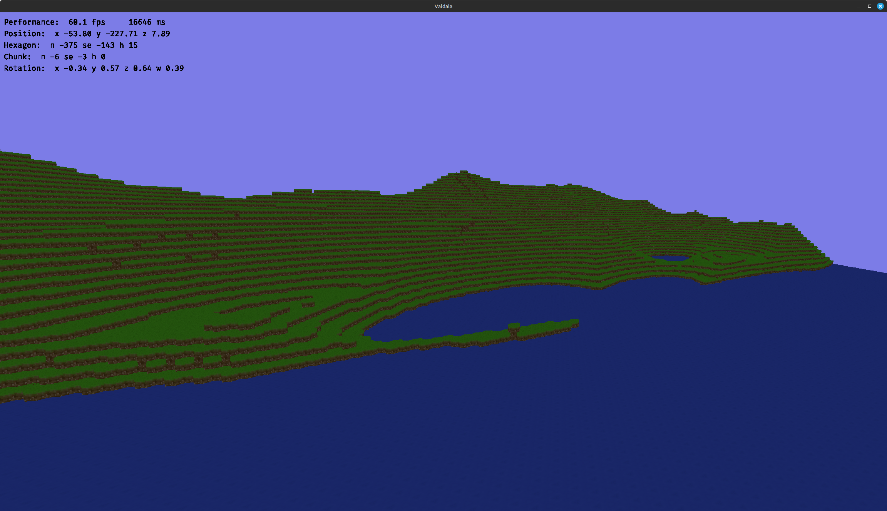

# Valdala

## Vision

Valdala plays in a procedurally generated 3D world made of hexagonal tiles.

You start with some basic survival gear and have to sustain yourself by gathering ressources.

You can craft basic tools and weapons and build basic shelter by yourself.

However, to get a stable source of food, more sophisticated equipment and solid housing, you need help of villagers.

Countless hostile creatures roam the world and most villagers are willing to work for you in exchange for protection.

You can guide your loyal villagers to develop their settlement, establish diplomatic ties with friendly neighbors and fight monsters and bandits to protect your towns and trade routes.

## Technology

I want to build Valdala on a foundation of high quality, future-proof technologies and as few external dependencies as reasonably possible.

Currently, the tech stack looks like this:

- [Zig](https://ziglang.org/) as the primary programming language for the engine
- a fast, modern, type-safe and expressive scripting language ([to be decided](./notes/scripting.md))
- [WebGPU](https://www.w3.org/TR/webgpu/) via wgpu-native as a cross-platform graphics API
- [GLFW](https://www.glfw.org/) for cross-platform window management and input handling

## Help Appreciated

Valdala is a passion project and I'm willing to spend countless hours trying to make it work on my own.

However, if anyone is willing to help out and learn a thing or two on the way, be my guest on this journey.

Find us [on Discord](https://discord.gg/9rcr2EVSTA).

### Engine Developers

There's a lot of engine to make and I'd appreciate some extra hands.

If you know Zig and have already worked on a game engine, that would be perfect!

If you a similar programming language and are willing to learn, we can work with that.

If you have a background in graphics or network programming or game related math concepts, feel free to reach out either way.

### Texture Artists

If you like making very small but pretty textures, you can paint the world.

### Concept Artists

I only have a vague idea how people, animals, monsters and other things in the game could look like.

If you can make drawings or 3d models of a sheep made of hexagons, let's talk.

### Game Designers

While I have a lot of general ideas about how the game should work, I would love to have someone to bounce dieas off and help with specific design decisions.

## Contribution Guidelines

### Zig version

The project currently builds with Zig version 0.15.2

I recommend to use the same one locally, as you might have issues with the build system and other breaking changes otherwise.

### Formatting

I generally follow the official Zig style guide: https://ziglang.org/documentation/0.15.2.

However, I do not use `zig fmt` because it's driving me crazy.

Please make use of extra line breaks after function signatures and between bigger blocks of logic.

Try to avoid abbreviations unless the names would get really unwieldy otherwise.

### Declaration order

This is not too strictly enforced, but I generally try to keep this order per file:

- import std
- refrences to std namespaces
- imports of project dependencies
- imports of project modules
- std types
- imported types
- simple nested types
- self type reference: `Self = @This`
- constants
- fields
- functions

### Changes

Small changes like typos and formatting of few lines can be made directly on the development branch.

For bigger changes, please create a separate branch and then a pull request.

Try to keep pull requests focused on a task, preferably linked to an issue.  
In particular, seprate new features and other improvements from bigger renaming, reorganizing and reformatting sprees.

### Dependencies

Try to keep the dependency on third parties to a minimum.

If feasible, we write and maintain it ourselves.

If maintaing a certain feature is too much work, prefer dependencies that are:
- up to date with our Zig version
- actively maintained
- focused on a specific task

Ask before adding new dependencies.
